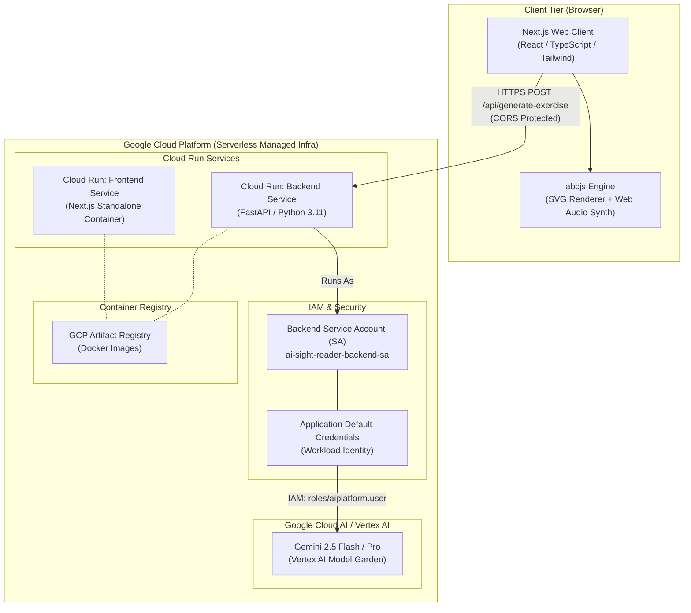

# System Architecture & Implementation Roadmap: AI-Driven Sight-Reading Platform (GCP Cloud-Native Edition)

## 1. Executive Summary

### 1.1 Objective
Design, construct, and deploy an enterprise-grade, cloud-native interactive web application capable of dynamically generating, visually rendering, and synthesizing playable musical sight-reading exercises through generative artificial intelligence.

### 1.2 Core Architectural Model
The system leverages a decoupled, serverless client-server architecture deployed on **Google Cloud Platform (GCP)**:
*   **Backend**: A Python FastAPI service hosted on **Google Cloud Run**, authenticating natively with **Gemini on Vertex AI** via a dedicated **GCP Service Account (SA)** using Application Default Credentials (ADC) — eliminating API key secrets in production.
*   **Frontend**: A Next.js (TypeScript + Tailwind CSS) single-page application hosted on **Google Cloud Run**, which parses ABC Notation from the backend, renders vector sheet music, and synthesizes interactive Web Audio.
*   **Infrastructure & Operations**: Complete Infrastructure as Code (IaC) via **Terraform** and automated shell provisioning scripts for zero-friction GCP environment setup, IAM role binding, Artifact Registry management, and automated Cloud Run deployment.

---

## 2. GCP Cloud-Native Architecture & Infrastructure

### 2.1 System Architecture Diagram



### 2.2 Security & Authentication Design: Gemini with Service Account (SA)
In adherence to cloud security best practices, **no hardcoded API keys** (`GEMINI_API_KEY`) are utilized in production:
1.  **Dedicated IAM Service Account**: A custom Cloud Run Service Account (`ai-sight-reader-backend-sa@<PROJECT_ID>.iam.gserviceaccount.com`) is provisioned.
2.  **Least-Privilege Role Binding**: The Service Account is granted `roles/aiplatform.user` on the GCP project, authorizing access to Vertex AI models.
3.  **Application Default Credentials (ADC)**: The Python backend uses the official `google-genai` SDK (`genai.Client(vertexai=True, project=PROJECT_ID, location=LOCATION)`). The SDK automatically retrieves OAuth2 access tokens via the Cloud Run metadata server without credential files.
4.  **Local Development Parity**: For local debugging, developers authenticate using `gcloud auth application-default login`, allowing the identical codebase to work seamlessly across local and production environments.

### 2.3 Modular Google ADK Agent Engine Architecture
To ensure the core AI composer is extensible, modular, and easy to duplicate for new instruments or specialized agents, the backend is built using the **Google ADK (Agent Development Kit)** (`google-adk`) with clear architectural separation:
*   **`backend/app/agent/prompt.py`**: Encapsulates all system instructions, pedagogical rules (prohibiting trills/ornamentation, enforcing exact measure counts, requiring rests), and few-shot reference templates.
*   **`backend/app/agent/tools.py`**: Defines standard ADK Tools (`validate_abc_score_tool`), keeping syntax validation, measure counting, and trill sanitization separate from agent logic.
*   **`backend/app/agent/agent.py`**: Defines the ADK `Agent` factory (`create_sight_reading_agent`), making it trivial to duplicate or extend for new specialized composer agents.
*   **`backend/app/agent/service.py`**: High-level orchestrator (`SightReadingAgentEngine`) providing self-healing automatic retries (`max_retries = 3`) when invoking the ADK agent.

### 2.4 Cloud Run Deployment & Scaling Strategy
*   **Backend Service (`ai-sight-reader-backend`)**:
    *   **Runtime**: Python 3.11+ slim container (Uvicorn ASGI server).
    *   **Concurrency**: 80 concurrent requests per instance.
    *   **Autoscaling**: 0 to 10 instances (scale-to-zero enabled to optimize cost).
    *   **Port**: 8080.
*   **Frontend Service (`ai-sight-reader-frontend`)**:
    *   **Runtime**: Node.js standalone Next.js container.
    *   **Autoscaling**: 0 to 10 instances with CDN caching headers.
    *   **Port**: 3000 (mapped to 8080 in Cloud Run container specification).
*   **Service-to-Service Communication**:
    *   Frontend queries the Backend API via HTTPS using the Cloud Run assigned URL (`https://backend-service-hash-uc.a.run.app`).
    *   CORS middleware in FastAPI explicitly permits requests originating from the Frontend Cloud Run domain.

---

### 2.5 Google Agent Registry & Gemini Enterprise Publishing (ADK / A2A)

The modular Google ADK Agent Engine (`backend/app/agent/`) is designed for native integration with Google Cloud's **Agent Registry (Preview)** and **Gemini Enterprise** through two supported registration modes:

#### 1. Agent Runtime Deployment (ADK Native Mode - `:streamQuery`)
When deploying the agent to Vertex AI Agent Runtime (`agents-cli deploy --deployment-target=agent_runtime`), the agent is **auto-registered** in Google Cloud Agent Registry.
*   **Registration Command**:
    ```bash
    agents-cli publish gemini-enterprise \
      --registration-type adk \
      --agent-runtime-id projects/<PROJECT_ID>/locations/<LOCATION>/reasoningEngines/<ENGINE_ID> \
      --gemini-enterprise-app-id projects/<PROJECT_ID>/locations/global/collections/default_collection/engines/<APP_ID> \
      --display-name "Sight-Reading Composer" \
      --description "Dynamic AI Sight-Reading Composer Agent"
    ```
*   **Execution Contract**: Gemini Enterprise invokes the agent natively via `:streamQuery` on its reasoning engine resource, dispatching directly to the ADK Agent's `streaming_agent_run_with_events` method.

#### 2. Cloud Run Container Deployment (A2A Protocol Mode)
When deploying as a serverless container on Cloud Run (`agents-cli deploy --deployment-target=cloud_run`), the agent serves the Agent-to-Agent (A2A) protocol via an agent card endpoint (`/a2a/app/.well-known/agent-card.json`).
*   **Registration Command**:
    ```bash
    agents-cli publish gemini-enterprise \
      --registration-type a2a \
      --agent-card-url https://<your-service-url>.run.app/a2a/app/.well-known/agent-card.json \
      --gemini-enterprise-app-id projects/<PROJECT_ID>/locations/global/collections/default_collection/engines/<APP_ID> \
      --display-name "Sight-Reading Composer" \
      --description "Dynamic AI Sight-Reading Composer Agent"
    ```

#### 3. Fleet Management via Google Cloud Agent Registry
Administrators can inspect and manage registered agents across the organization's Google Cloud fleet using `gcloud alpha agent-registry`:
```bash
# List all registered agents in the project
gcloud alpha agent-registry agents list --project <PROJECT_ID> --location <LOCATION>

# Inspect specific agent details
gcloud alpha agent-registry agents describe sight-reading-composer
```

---

## 3. Technical Stack & Component Specification

### 3.1 Frontend Framework & Notation Engine
*   **Framework**: Next.js 15 (App Router) with React 19, TypeScript, and Tailwind CSS.
*   **UI Aesthetics**: Premium dark-mode glassmorphism theme, smooth micro-animations, and responsive typography (Inter/Outfit fonts).
*   **Sheet Music & Audio Engine**: `abcjs` library (`abcjs.renderAbc` for SVG score rendering and `abcjs.synth.CreateSynth` for Web Audio synthesis).
*   **State Management**: React custom hooks (`useSightReader`) managing exercise state, audio playback context, and loading animations.

### 3.2 Backend Service & Generative AI Layer
*   **Framework**: FastAPI with Pydantic v2 validation and Uvicorn ASGI server.
*   **AI SDK**: Google GenAI SDK (`google-genai`) configured for Vertex AI (`vertexai=True`).
*   **Model**: `gemini-2.5-flash` (primary for low-latency sight-reading generation) or `gemini-2.5-pro` (for advanced harmonic complexity).
*   **ABC Syntax Guardrails**: Automated regex-based pre-validation of generated ABC headers (`X:`, `T:`, `K:`, `M:`, `L:`) before payload dispatch.

---

## 4. Implementation Plan & Folder Structure

### 4.1 Whole-Project Boilerplate Structure
```
sight-reading-tool/
├── README.md                      # Complete system documentation, setup, and architecture
├── .gitignore                     # Git exclusion rules for Node, Python, and Terraform
├── docker-compose.yml             # Local multi-container development environment
├── docs/
│   ├── Design.md                  # Comprehensive GCP Cloud-Native Architecture Document
│   └── Plan.md                    # Phased engineering roadmap and execution plan
├── infra/                         # Terraform Infrastructure as Code (IaC)
│   ├── main.tf                    # GCP provider & API service enablement
│   ├── variables.tf               # Configurable project, region, and service variables
│   ├── iam.tf                     # Cloud Run Service Account & Vertex AI IAM roles
│   ├── artifact_registry.tf       # Docker container registry configuration
│   ├── cloudrun.tf                # Backend & Frontend Cloud Run services
│   └── outputs.tf                 # Generated service URLs & IAM emails
├── scripts/                       # Automation & Ops Shell Scripts
│   ├── setup_gcp.sh               # Bootstrap GCP APIs, Service Account, and IAM bindings
│   ├── deploy_cloudrun.sh         # Build container images via Cloud Build and deploy
│   └── dev_local.sh               # Run local development environment with hot reload
├── backend/                       # Python FastAPI Backend Service
│   ├── Dockerfile                 # Slim multi-stage Python 3.11 Cloud Run container
│   ├── pyproject.toml / requirements.txt # Dependencies (fastapi, google-genai, pydantic, etc.)
│   ├── .env.example               # Template environment configuration
│   ├── app/
│   │   ├── __init__.py
│   │   ├── main.py                # Application entrypoint, CORS, and router mount
│   │   ├── config.py              # Pydantic BaseSettings loading GCP/local env vars
│   │   ├── schemas/
│   │   │   ├── __init__.py
│   │   │   └── exercise.py        # Pydantic request/response schemas
│   │   ├── services/
│   │   │   ├── __init__.py
│   │   │   └── gemini_service.py  # Vertex AI Gemini service via SA/ADC
│   │   ├── utils/
│   │   │   ├── __init__.py
│   │   │   └── abc_validator.py   # ABC Notation syntax & header validation
│   │   └── api/
│   │       ├── __init__.py
│   │       └── endpoints.py       # POST /api/generate-exercise, GET /health
│   └── tests/                     # Unit & API test suite
│       ├── test_health.py
│       └── test_validator.py
└── frontend/                      # Next.js TypeScript Frontend
    ├── Dockerfile                 # Standalone multi-stage Cloud Run container
    ├── package.json / tsconfig.json / tailwind.config.ts
    ├── .env.example               # NEXT_PUBLIC_BACKEND_URL configuration
    └── src/
        ├── app/
        │   ├── layout.tsx         # Root layout with Inter font and dark theme
        │   ├── page.tsx           # Primary interactive sight-reading studio
        │   └── globals.css        # Premium custom CSS utilities and gradients
        ├── components/
        │   ├── ControlDashboard.tsx # Difficulty, Key, Meter & Instrument selector
        │   ├── SheetMusicDisplay.tsx # Responsive SVG sheet music container
        │   ├── AudioPlayer.tsx     # Web Audio synth playback & tempo controls
        │   └── ErrorAlert.tsx      # Graceful error state visualization
        ├── lib/
        │   └── api.ts             # Typed HTTP client for backend interaction
        └── types/
            └── exercise.ts        # Shared TypeScript interfaces
```

---

## 5. Phased Development Roadmap

### Phase 1: GCP Infrastructure & Service Account Provisioning
*   Execute `scripts/setup_gcp.sh` to enable GCP APIs (`aiplatform.googleapis.com`, `run.googleapis.com`, `artifactregistry.googleapis.com`, `cloudbuild.googleapis.com`).
*   Provision Cloud Run Service Account (`ai-sight-reader-backend-sa`) and bind `roles/aiplatform.user`.
*   Validate IAM Workload Identity and Application Default Credentials.

### Phase 2: Python FastAPI Backend with Vertex AI Gemini SA Auth
*   Implement `gemini_service.py` using `google-genai` SDK with `vertexai=True`.
*   Enforce ABC notation prompt constraints: *"Act as an expert musicologist and educator. Generate a concise sight-reading exercise. The response must consist exclusively of valid ABC notation, strictly omitting explanatory text or Markdown formatting. The payload must begin with the standard X: header field."*
*   Implement strict ABC syntax pre-validation via `abc_validator.py`.
*   Containerize FastAPI backend with Cloud Run optimized `Dockerfile` (listening on port `8080`).

### Phase 3: Next.js Frontend & abcjs Rendering Studio
*   Construct rich, visually engaging user interface with dark-mode glassmorphic controls.
*   Develop `<SheetMusicDisplay />` wrapper utilizing `abcjs.renderAbc` with SVG scaling (`responsive: 'resize'`).
*   Implement `<AudioPlayer />` utilizing `abcjs.synth.CreateSynth()` while respecting browser user-gesture AudioContext requirements.
*   Containerize standalone Next.js frontend for Cloud Run deployment.

### Phase 4: DevOps Automation & Cloud Run Deployment
*   Verify Terraform scripts (`infra/`) for reproducible infrastructure management.
*   Execute `scripts/deploy_cloudrun.sh` to trigger Google Cloud Build image builds in Artifact Registry and deploy services to Cloud Run.
*   Validate end-to-end user flow: browser parameter selection -> Cloud Run Backend -> Vertex AI Gemini -> ABC syntax validation -> frontend SVG rendering and audio synthesis.
